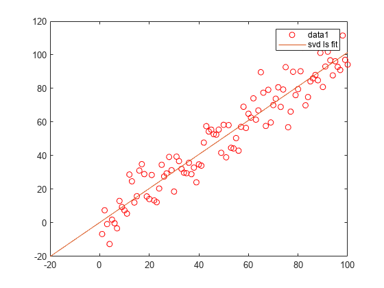

# Linear Least Squares Problems Using SVD, straight line fitting (2D and 3D)

[](https://ww2.mathworks.cn/matlabcentral/fileexchange/133277-svd-fit-line)

[](https://matlab.mathworks.com/open/github/v1?repo=cuixing158/SVD-Fit-Line&file=svd_fit_line.mlx)

 cuixingxing150@gmail.com

 崔星星 2023.8.6

The set of points located in the plane points fitted to a straight line, using the SVD method can be very convenient to solve, given below are several methods to solve.

## Linear fitting of 2D point sets

```matlab
x = 1:100;
y = x+10*randn(1,100);
plot(x,y,'ro',DisplayName="points");hold on;
legend
```


- Method1

Find the right singular vector corresponding to the largest singular value, i.e., the principal direction.

```matlab
points = [x',y'];
A =  points- mean(points);
[U,S,V] = svd(A);
direction = V(:,1);% 主元方向
t = -10:100;
x_ = direction(1).*t;
y_ = direction(2).*t;
plot(x_,y_,'b-',DisplayName="svd fit")
```


```matlab
legend;
```

- Method2


$$
\left\lbrack U,S,V\right\rbrack =\textrm{svd}\left(A\right)
$$

I tried to make the $\textrm{Ax}=0$  form of non-zero least squares solution (the optimal solution is the column vector corresponding to the smallest singular value of V), so it was designed to be solved in the general form $a*x+b*y+c=0$, but because a, b, c variables are not independent unless the constraints are imposed $a^2 +b^2 +c^2 =1$, then it becomes a non-linear least squares, and so it was designed to be ineffective in the general form.

For the above data set and the general formula, if slightly modified, so that c = 1, the general formula becomes $a*x+b*y+1=0$, this formula can express any plane can not cross the origin of the straight line, but the above data set to fit the straight line is obviously close to the origin, so the general formula is also invalid.

In summary, according to the characteristics of the data set, the general formula is best designed as a form $y=k*x+b$, this formula can express any straight line in the plane can not be perpendicular to the $x$ axis. At this point the SVD solves for the non-chiral linear least squares solution $\textrm{Ax}=b$.

尝试弄成$\textrm{Ax}=0$ 的齐次形式求取非零最小二乘解（**最优解是V的最小奇异值对应的列向量**）,故设计成$a*x+b*y+c=0$通用形式求解,但因为a,b,c变量并非独立，除非施加约束$a^2 +b^2 +c^2 =1$,此时变为非线性最小二乘了，故设计为一般通式无效。

针对上述数据集和通式，如果稍微修改一下，令c=1,通式变为$a*x+b*y+1=0$，此式可以表达平面上任意不能过原点的直线，但上述数据集拟合直线明显接近原点，故此通式也无效。

综上所述，根据数据集特点，通式最好设计为$y=k*x+b$形式，此式可以表达平面上任意不能垂直于$x$轴的直线。此时SVD求解$\textrm{Ax}=b$的非齐次线性最小二乘解。


```matlab
% https://ww2.mathworks.cn/matlabcentral/answers/66555-using-svd-to-solve-systems-of-linear-equation-have-to-implement-direct-parameter-calibration-method
x = 1:100;
y = x+10*randn(1,100);
figure;plot(x,y,'ro');hold on;
A = [x',ones(length(x),1)];
b = y';
[U,S,V] = svd(A);
coff = (V*pinv(S)*U')*b; % or use coff = A\b;
fimplicit(@(x,y)coff(1)*x+coff(2)-y,DisplayName="svd ls fit")
legend;
```



## 3D point set linear fitting

```matlab
%% fit 3d line
x = (1:100)+10*randn(1,100);
y = (1:100)+10*randn(1,100);
z = (1:100)+10*randn(1,100);
figure;
plot3(x,y,z,'b.')
grid on;hold on;

points = [x',y',z'];
avg = mean(points,1);
subtracted = points-avg;
[~,~,V] = svd(subtracted);
direction = V(:,1);
t = -100:100;
x_ = avg(1)+direction(1)*t;
y_ = avg(2)+direction(2)*t;
z_ = avg(3)+direction(3)*t;
plot3(avg(1),avg(2),avg(3),'ro')
plot3(x_,y_,z_,DisplayName="svd fit")
legend;
```


## References

[http://graphics.ics.uci.edu/ICS6N/NewLectures/Lecture19.pdf](http://graphics.ics.uci.edu/ICS6N/NewLectures/Lecture19.pdf)

[What is benefit to use SVD for solving Ax=b](https://stackoverflow.com/questions/32711920/what-is-benefit-to-use-svd-for-solving-ax-b)

[矩阵SVD分解（理论部分II——利用SVD求解最小二乘问题）](https://zhuanlan.zhihu.com/p/64273563)
